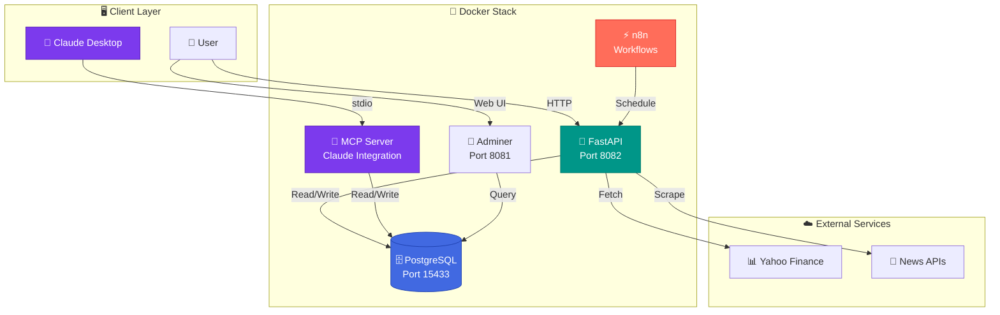
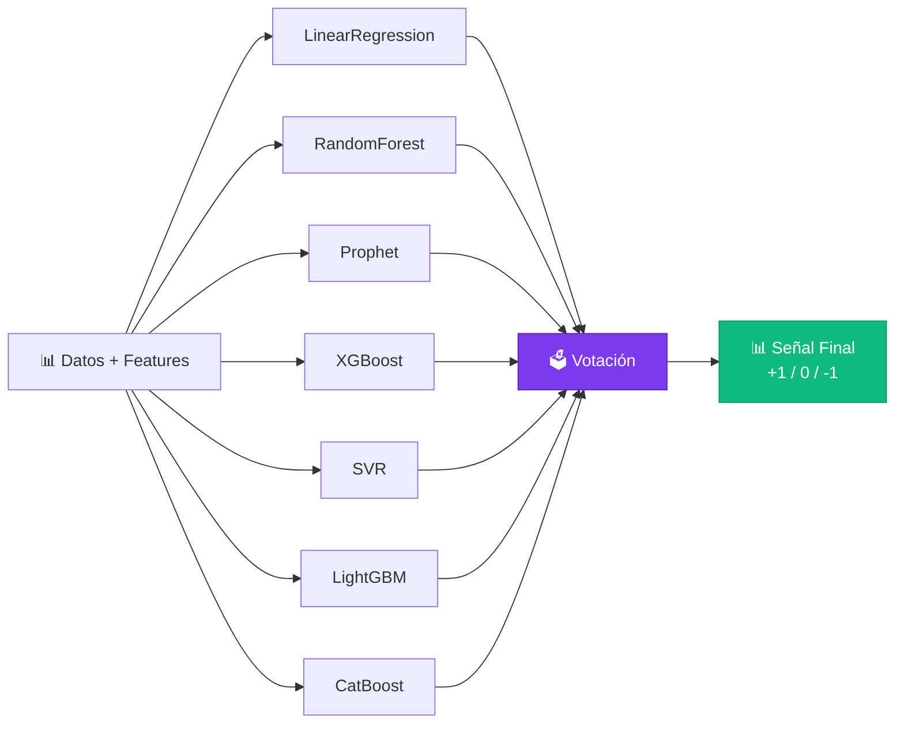

<div align="center">

# 📈 Stock ML Prediction Platform

### Enterprise-Grade Financial Market Prediction System

[](https://www.docker.com/)
[](https://www.python.org/)
[](https://fastapi.tiangolo.com/)
[](https://www.postgresql.org/)
[](https://modelcontextprotocol.io/)
[](LICENSE)

*AI-powered financial market prediction platform with Machine Learning ensemble models, automated workflows, and conversational AI integration*

[Features](#-features) • [Architecture](#-architecture) • [Project Structure](#-project-structure) • [Quick Start](#-quick-start) • [API](#-rest-api) • [Machine Learning](#-machine-learning) • [MCP Integration](#-claude-desktop-integration) • [Documentation](#-documentation)

</div>

---

## 🚀 Features

### 🤖 Machine Learning & Prediction

- **7-Model Ensemble**: LinearRegression, RandomForest, Prophet, XGBoost, SVR, LightGBM, CatBoost
- **Intelligent Voting System**: Trading signals (+1, 0, -1) based on model consensus
- **Automated Validation**: Daily backtesting comparing predictions vs actual values
- **Historical Backfill**: Generate historical predictions without look-ahead bias for retrospective analysis
- **Hyperparameter Tuning**: Grid search or Bayesian optimization with auto-retraining
- **Persistent Storage**: Trained models saved for reuse and reproducibility

### 📊 Market Analysis

- **3 Major Indices**: IBEX35 (Spain), S&P500 (USA), NIKKEI (Japan)
- **Global Coverage**: Europe, Americas, Asia-Pacific
- **Technical Indicators**: SMA(20/50), RSI(14), Volatility, Returns
- **News Analysis**: Dual-source (Yahoo Finance + Google RSS) with sentiment analysis
- **Historical Data**: OHLCV prices from Yahoo Finance

### 🔄 Automation & Orchestration

- **n8n Workflows**: Automated ETL pipelines for data ingestion and processing
- **Daily Scheduling**: Automatic updates for data, indicators, and predictions
- **Automated Reports**: Daily market summary generation

### 🐳 Cloud-Native Architecture

- **Docker Compose**: Complete stack with a single command
- **Microservices**: PostgreSQL, FastAPI, n8n, Adminer
- **Optimized Images**: Pre-built MCP image with all dependencies
- **Persistent Volumes**: Data and models survive restarts

### 💬 Conversational AI Integration

- **Model Context Protocol (MCP)**: MCP server for Claude Desktop
- **7 Conversational Tools**: Query prices, predictions, indicators, news via chat
- **Real-Time Analysis**: Ask Claude about markets in natural language
- **Dockerized Execution**: Isolated MCP server with all dependencies

## 🏗️ Architecture



### 📦 Technology Stack

| Component | Technology | Port | Function |
|-----------|------------|------|----------|
| **Database** | PostgreSQL 15 | 15433 | Storage for prices, indicators, predictions |
| **REST API** | FastAPI + Uvicorn | 8082 | Endpoints for ETL, ML, reporting |
| **MCP Server** | Python + MCP SDK | stdio | Claude Desktop integration |
| **Automation** | n8n | 5678 | Scheduled workflows and ETL |
| **DB Admin** | Adminer | 8081 | Web interface for database management |
| **ML Models** | scikit-learn, XGBoost, Prophet | - | 7-model ensemble |
| **Containerization** | Docker + Docker Compose | - | Complete orchestration |

## 📦 System Components

### 🗄️ Database (PostgreSQL 15)

**Port**: 15433 | **Credentials**: finanzas/finanzas_pass

#### Database Schema

| Table | Description | Key Fields |
|-------|-------------|------------|
| `prices` | Historical OHLCV data | symbol, date, open, high, low, close, volume |
| `indicators` | Technical indicators | symbol, date, sma_20, sma_50, rsi_14, volatility_20 |
| `signals` | Trading signals | symbol, date, signal (-1, 0, +1) |
| `news` | Financial news | symbol, title, url, published_at, sentiment |
| `ml_predictions` | ML predictions | symbol, prediction_date, model_name, predicted_value, true_value, error_abs |

#### Database Management with Adminer

Access **http://localhost:8081** to:
- Explore tables and data
- Execute SQL queries
- Export/import data
- View database structure

### 🚀 REST API (FastAPI)

**Port**: 8082 | **Docs**: http://localhost:8082/docs

High-performance server with:
- **20+ endpoints** for ETL, ML and reporting
- **Interactive documentation** (Swagger UI)
- **Automatic validation** with Pydantic
- **Fast responses** with in-memory cache

### 💬 MCP Server (Claude Integration)

**Protocol**: stdio | **Docker**: Pre-built optimized image

Specialized server that:
- Exposes **7 tools** to Claude Desktop
- Runs in **isolated Docker environment**
- Accesses **same database** as REST API
- Enables **conversational analysis** in natural language

[See complete documentation →](docs/mcp/README.md)

### ⚡ n8n (Automation)

**Port**: 5678 | **Credentials**: admin/admin123

Automation platform for:
- **Scheduled workflows** (cron jobs)
- **Automated ETL pipelines**
- **Integration** with external services
- **Report generation** (PDF/Email)

Pre-configured workflows:
1. 🌅 **Daily Update** (8:00 AM): Download prices and news
2. 📊 **Compute Indicators** (8:30 AM): Calculate technical indicators
3. 🤖 **ML Prediction** (9:00 AM): Run ensemble and save prediction
4. ✅ **Validation** (9:30 AM): Validate previous day predictions
5. 📧 **Daily Report** (10:00 AM): Send daily summary

## 📁 Project Structure

```
stock-ml-prediction-platform/
│
├── 📱 Main Applications
│   ├── streamlit_dashboard.py          # Interactive web dashboard
│   ├── telegram_bot.py                 # Telegram bot for alerts
│   └── docker-compose.yml              # Docker orchestration
│
├── 🔧 MCP Server (Claude Integration)
│   └── mcp_server/
│       ├── app/
│       │   ├── main.py                 # FastAPI MCP server
│       │   └── __init__.py
│       └── scripts/                    # Core ML & Data modules
│           ├── assets.py               # Market symbols management
│           ├── fetch_data.py           # Data ingestion (Yahoo Finance)
│           ├── indicators.py           # Technical indicators (SMA, RSI, etc.)
│           ├── advanced_indicators.py  # Advanced indicators (MACD, Bollinger, ADX)
│           ├── models.py               # 7 ML models + ensemble
│           ├── backtesting.py          # Performance validation system
│           ├── save_predictions.py     # Prediction storage
│           ├── validate_predictions.py # Historical validation
│           ├── backfill_predictions.py # Historical data backfill
│           ├── news.py                 # News scraping & sentiment
│           ├── reporting.py            # Report generation
│           ├── model_storage.py        # Model persistence
│           ├── model_evaluation.py     # Model metrics
│           ├── clean_data.py           # Data cleaning
│           ├── build_validation_dataset.py
│           └── config.py               # Database configuration
│
├── 🗄️ Database & Infrastructure
│   ├── db-init/
│   │   ├── 01_init.sql                # Database schema
│   │   └── 02_ml_predictions.sql      # ML tables
│   └── data/
│       ├── db/                         # PostgreSQL data volume
│       └── models/                     # Saved ML models
│
├── ⚙️ Automation & Workflows
│   ├── n8n/                            # n8n workflows
│   │   └── config                      # n8n configuration
│   └── n8n_data/                       # n8n data volume
│
├── 📜 Utility Scripts
│   └── scripts/
│       ├── quickstart.sh               # Interactive launch menu
│       ├── run_backfill.sh            # Historical data backfill
│       └── README.md                   # Scripts documentation
│
├── 🧪 Testing
│   └── tests/
│       ├── test_3_markets.py          # Market tests
│       ├── test_backfill_fix.py       # Backfill tests
│       └── README.md                   # Test documentation
│
├── 📊 Reports & Outputs
│   ├── backtest_reports/              # Backtesting results (JSON)
│   │   └── README.md
│   └── reports/                        # General reports
│       └── README.md
│
├── 📚 Documentation
│   └── docs/
│       ├── README.md                   # Project overview
│       ├── NEW_FEATURES.md            # Latest features guide
│       ├── REQUIREMENTS.md            # System requirements
│       ├── BACKFILL_README.md         # Backfill documentation
│       ├── CHECKLIST.md               # Verification checklist
│       ├── RESUMEN_IMPLEMENTACION.md  # Implementation summary (ES)
│       ├── IMPLEMENTATION_SUMMARY.txt # Visual summary
│       ├── README_NEW_SECTION.md      # README additions
│       └── mcp/                        # MCP-specific docs
│           ├── README.md
│           ├── GUIA_COMPLETA.md
│           ├── EJEMPLOS.md
│           └── DOCKER_SETUP.md
│
├── 📋 Configuration Files
│   ├── .env                           # Environment variables
│   ├── .gitignore                     # Git ignore rules
│   ├── requirements-new-features.txt  # New features dependencies
│   ├── LICENSE                        # MIT License
│   └── README.md                      # This file
│
└── 🐍 Virtual Environments (optional)
    └── PID/                           # Python virtual environment
```

### 📦 Key Directories Explained

| Directory | Purpose | Key Files |
|-----------|---------|-----------|
| `mcp_server/scripts/` | Core ML logic and data processing | `models.py`, `backtesting.py`, `indicators.py` |
| `scripts/` | Utility scripts for automation | `quickstart.sh`, `run_backfill.sh` |
| `tests/` | Test suite for validation | `test_3_markets.py`, `test_backfill_fix.py` |
| `backtest_reports/` | Backtesting results (auto-generated) | `backtest_report_*.json` |
| `docs/` | Comprehensive documentation | `NEW_FEATURES.md`, `REQUIREMENTS.md` |
| `data/db/` | PostgreSQL data persistence | Database files |
| `data/models/` | Trained ML models storage | `.pkl` model files |
| `db-init/` | Database initialization | SQL schema files |
| `n8n/` & `n8n_data/` | Workflow automation | n8n configuration |

### 🔑 Important Files

- **`streamlit_dashboard.py`** → Web dashboard (4 tabs: Prices, Indicators, Backtesting, Heatmap)
- **`telegram_bot.py`** → Telegram bot with 10+ commands
- **`mcp_server/scripts/models.py`** → 7 ML models + ensemble voting
- **`mcp_server/scripts/backtesting.py`** → Performance validation with metrics
- **`mcp_server/scripts/advanced_indicators.py`** → MACD, Bollinger, ADX, ATR, etc.
- **`scripts/quickstart.sh`** → Interactive menu for all features
- **`docker-compose.yml`** → Complete infrastructure setup

## 🚀 Quick Start

### Prerequisites

```bash
# Check installations
docker --version          # Docker 20.10+
docker-compose --version  # Docker Compose 2.0+
python3 --version         # Python 3.11+ (optional, for development)
```

### Option 1: Docker Compose (Recommended)

```bash
# 1. Clone the repository
git clone https://github.com/gortif00/stock-ml-prediction-platform.git
cd stock-ml-prediction-platform

# 2. Configure environment variables (optional, defaults provided)
cp .env.example .env

# 3. Start all services
docker-compose up -d

# 4. Verify everything is running
docker-compose ps

# 5. View real-time logs
docker-compose logs -f mcp
```

**✅ Ready!** Services will be available at:
- 🚀 REST API: http://localhost:8082/docs
- 🗄️ Adminer: http://localhost:8081
- ⚡ n8n: http://localhost:5678

### Option 2: Local Development

```bash
# 1. Create virtual environment
python3 -m venv venv
source venv/bin/activate  # On Windows: venv\Scripts\activate

# 2. Install dependencies
pip install -r mcp_server/requirements.txt

# 3. Start only the database
docker-compose up -d db

# 4. Run the server locally
cd mcp_server
uvicorn app.main:app --reload --port 8082
```

### Initial Configuration

The `.env` file contains main configurations:

```env
# Exposed ports
POSTGRES_PORT=15433
N8N_PORT=5678
MCP_PORT=8082

# Database credentials
POSTGRES_USER=finanzas
POSTGRES_PASSWORD=finanzas_pass
POSTGRES_DB=indices
MCP_DB_NAME=indices
```

### Installation Verification

```bash
# Container status
# API health check
curl http://localhost:8082/health

# PostgreSQL connection
docker exec -it db_finanzas psql -U finanzas -d indices -c "\dt"

# View logs
docker-compose logs --tail=50 mcp
```

## 📡 REST API

### 📖 Interactive Documentation

The API includes complete documentation with **Swagger UI** and **ReDoc**:

- **Swagger UI**: http://localhost:8082/docs
- **ReDoc**: http://localhost:8082/redoc
- **OpenAPI JSON**: http://localhost:8082/openapi.json

### 🔥 Quick Start

#### Complete Pipeline - IBEX35

```bash
# 1. Update prices (last month)
curl "http://localhost:8082/update_prices?market=ibex35&period=1mo"

# 2. Update news (last week)
curl "http://localhost:8082/update_news?markets=IBEX35&days=7"

# 3. Calculate technical indicators
curl "http://localhost:8082/compute_indicators?market=ibex35"

# 4. Generate trading signals
curl "http://localhost:8082/compute_signals?market=ibex35"

# 5. ML prediction (7-model ensemble)
curl "http://localhost:8082/predecir_ensemble?symbol=^IBEX"

# 6. Complete daily summary
curl "http://localhost:8082/daily_summary?market=ibex35"
```

### 📊 Endpoints by Category

#### 🔄 ETL - Data Ingestion

```bash
# Update prices (periods: 1d, 5d, 1mo, 3mo, 6mo, 1y)
GET /update_prices?market=ibex35&period=1mo

# Update news from multiple markets
GET /update_news?markets=IBEX35,SP500,NASDAQ&days=7
```

#### 📈 ETL - Indicators and Signals

```bash
# Calculate technical indicators (SMA, RSI, Volatility)
GET /compute_indicators?market=ibex35

# Generate trading signals (+1, 0, -1)
GET /compute_signals?market=ibex35
```

#### 🤖 Machine Learning

```bash
# Simple rule-based prediction
GET /predecir_simple?symbol=^IBEX

# Ensemble prediction (7 ML models + voting)
GET /predecir_ensemble?symbol=^IBEX

# Force model retraining
POST /retrain_models?symbol=^IBEX

# Validate previous day predictions
POST /validate_predictions

# Validate predictions for specific date
POST /validate_predictions?date_str=2025-12-01
```

#### 📋 Reporting and Analysis

```bash
# Complete daily market summary
GET /daily_summary?market=ibex35

# ML model information
GET /model_info?symbol=^IBEX

# Health check
GET /health
```

### 📝 Python Examples

```python
import requests

BASE_URL = "http://localhost:8082"

# Get current price
response = requests.get(f"{BASE_URL}/update_prices", params={
    "market": "ibex35",
    "period": "1d"
})
print(response.json())

# ML prediction
response = requests.get(f"{BASE_URL}/predecir_ensemble", params={
    "symbol": "^IBEX"
})
prediction = response.json()
print(f"Signal: {prediction['señal_final']}")
print(f"Consensus: {prediction['consenso']}")

# Daily summary
response = requests.get(f"{BASE_URL}/daily_summary", params={
    "market": "ibex35"
})
summary = response.json()
print(summary['formatted_report'])
```

## 💬 Claude Desktop Integration

### What is MCP?

**Model Context Protocol (MCP)** allows Claude Desktop to access external tools in real-time. With this integration, you can analyze financial markets through natural conversation.

### 🚀 Setup in 3 Steps

#### 1. Build the MCP Server Docker image

```bash
cd stock-ml-prediction-platform
docker build -t mcp-finance-server:latest -f mcp_server_claude/Dockerfile .
```

#### 2. Configure Claude Desktop

**macOS:** Edit `~/Library/Application Support/Claude/claude_desktop_config.json`

**Windows:** Edit `%APPDATA%\Claude\claude_desktop_config.json`

```json
{
  "mcpServers": {
    "finance-predictor": {
      "command": "/ruta/completa/PID_bolsa/mcp_server_claude/run_docker_optimized.sh",
      "args": []
    }
  }
}
```

#### 3. Reiniciar Claude Desktop

Cierra completamente Claude Desktop (Cmd/Ctrl+Q) y vuelve a abrirlo.

### 🎯 Herramientas Disponibles

Una vez configurado, Claude tendrá acceso a estas 7 herramientas:

| Herramienta | Descripción |
|-------------|-------------|
| `get_market_price` | Obtiene el último precio disponible (OHLCV) |
| `get_prediction` | Predicción ML mediante ensemble de 7 modelos |
| `get_indicators` | Indicadores técnicos (SMA, RSI, Volatilidad) |
| `get_news` | Últimas noticias financieras del mercado |
| `update_market_data` | Actualiza precios desde Yahoo Finance |
| `get_daily_summary` | Resumen completo del día (precio, indicadores, señales, noticias) |
| `validate_predictions` | Valida predicciones del día anterior vs valores reales |

### 💬 Ejemplos de Uso

Una vez configurado, puedes preguntarle a Claude:

```
🗣️ "¿Tienes acceso a herramientas financieras?"
→ Claude confirmará que tiene 7 herramientas disponibles

🗣️ "¿Cuál es el precio actual del IBEX35?"
→ Claude usará get_market_price y te mostrará OHLCV

🗣️ "Dame la predicción ML para el S&P 500"
→ Claude ejecutará get_prediction con ensemble de 7 modelos

🗣️ "Muéstrame el resumen diario completo del NASDAQ"
→ Claude generará análisis con precio, indicadores, señales y noticias

🗣️ "¿Qué noticias recientes hay sobre el NIKKEI?"
→ Claude obtendrá las últimas noticias financieras

🗣️ "Actualiza los datos del IBEX35 del último mes"
→ Claude descargará datos históricos actualizados
```

### 📚 Documentación Completa

📖 **[Ver toda la documentación en /docs](docs/)**

#### 🤖 Integración con IA
- **[MCP Setup](docs/mcp/README.md)** - Integración con Claude Desktop
- **[Docker Setup](docs/mcp/DOCKER_SETUP.md)** - Configuración Docker (macOS/Linux/Windows)
- **[Ejemplos MCP](docs/mcp/EJEMPLOS.md)** - Casos de uso conversacionales
- **[Guía MCP Completa](docs/mcp/GUIA_COMPLETA.md)** - Arquitectura y troubleshooting

#### 📊 Machine Learning
- **[Backfill de Predicciones](BACKFILL_README.md)** - Predicciones históricas sin look-ahead bias
- **[Requirements](docs/REQUIREMENTS.md)** - Gestión de dependencias Python

### 🐳 Opciones de Ejecución

| Método | Tiempo inicio | Aislamiento | Recomendado para |
|--------|---------------|-------------|-------------------|
| **Docker Optimizado** | ~2s | ✅ | Producción / Demo |
| **Docker Simple** | ~15s | ✅ | Testing |
| **Directo (Python)** | <1s | ❌ | Desarrollo |

---

## 🔧 Desarrollo Local

### Instalar Dependencias

```bash
# Crear entorno virtual
python3 -m venv PID
source PID/bin/activate

# Instalar dependencias
pip install -r mcp_server/requirements.txt
```

### Ejecutar el Servidor MCP Localmente

```bash
cd mcp_server
uvicorn app.main:app --reload --host 0.0.0.0 --port 8000
```

### Script de Descarga Manual

```bash
python download_ibex.py
```

This will download IBEX35 data to `./data/^IBEX_prices.csv`.

## 🤖 Machine Learning

### Ensemble Architecture

The system implements a **7-model ensemble** with majority voting:



### Implemented Models

| Model | Type | Advantages | Key Parameters |
|-------|------|------------|----------------|
| **Linear Regression** | Baseline | Simple, interpretable | - |
| **Random Forest** | Tree Ensemble | Robust, no normalization needed | n_estimators=100 |
| **Prophet** | Time Series | Handles seasonality and trends | daily_seasonality=True |
| **XGBoost** | Gradient Boosting | High accuracy, fast | max_depth=5, learning_rate=0.1 |
| **SVR** | Kernel Methods | Effective in high-dimensional spaces | kernel='rbf', C=1.0 |
| **LightGBM** | Gradient Boosting | Very fast, memory efficient | num_leaves=31 |
| **CatBoost** | Gradient Boosting | Handles categories automatically | iterations=100 |

### Feature Engineering

#### Base Features (OHLCV Prices)
- `Open`, `High`, `Low`, `Close`, `Volume`

#### Technical Indicators
- **SMA(20)**: Simple Moving Average 20-day
- **SMA(50)**: Simple Moving Average 50-day
- **RSI(14)**: Relative Strength Index (0-100)
- **Volatility(20)**: Standard deviation of returns

#### Temporal Features
- `day_of_week`: Monday=0, Friday=4
- `month`: 1-12
- `return_1d`: Previous day return

### Trading Signals

The system generates 3 types of signals:

| Signal | Value | Meaning | Action |
|--------|-------|---------|--------|
| 🟢 BUY | +1 | Price will rise | Open long position |
| 🟡 NEUTRAL | 0 | No clear movement | Hold position |
| 🔴 SELL | -1 | Price will fall | Close position / Short |

### Voting Process

1. Each model predicts signal independently: +1, 0, or -1
2. Votes are counted for each signal
3. **Simple majority** determines final signal
4. **Consensus** = (majority_votes / 7) × 100%

**Example:**
```
LinearRegression: +1
RandomForest:     +1
Prophet:          +1
XGBoost:          +1
SVR:              0
LightGBM:         +1
CatBoost:         +1

Final Signal: +1 (BUY)
Consensus: 85.7% (6/7 models)
```

### Validation and Backtesting

- **Daily Validation**: Compares previous day predictions vs actual price
- **Metrics**: Absolute error, percentage error
- **Storage**: All predictions saved in `ml_predictions`
- **Tracking**: Individual performance per model and per market

### 🔄 Historical Predictions Backfill

El sistema incluye funcionalidad para **generar predicciones históricas sin look-ahead bias**, útil para:
- ✅ Análisis de rendimiento histórico de modelos
- ✅ Llenar datos faltantes si el sistema estuvo caído
- ✅ Backtesting de estrategias de trading
- ✅ Evaluación de modelos en períodos específicos

#### Características del Backfill

El script implementa **filtrado temporal estricto** para evitar información del futuro:

```python
# For each historical date D:
predict_ensemble(symbol, as_of_date=D, force_retrain=True)
# ✅ Only uses data available until date D
# ✅ Retrains models with correct historical data
# ✅ No look-ahead bias
```

**Backfill Flow:**


#### How to Use

**Option 1: Helper Script (Recommended)**
```bash
./run_backfill.sh
```

**Option 2: Direct from Docker**
```bash
docker exec -it mcp_finance python -m scripts.backfill_predictions
```

**Option 3: Custom Python**
```python
from scripts.backfill_predictions import backfill_predictions_for_symbol
from datetime import date

# Backfill for IBEX35 (Dec 1-10, 2024)
backfill_predictions_for_symbol(
    symbol="^IBEX",
    start_date=date(2024, 12, 1),
    end_date=date(2024, 12, 10)
)
```

#### Important Considerations

⚠️ **Performance**: Backfill retrains 7 ML models for each date, which may take several minutes per day.

⚠️ **Requirements**: Price and indicator data must exist for all dates in the range.

⚠️ **Execution**: Only works inside Docker container (requires `DB_HOST=db`).

✅ **Validation**: After backfill, validate results:
```bash
# Validate predictions for a specific date
curl "http://localhost:8082/validate_predictions?date_str=2024-12-05"

# Analyze performance in a range
curl "http://localhost:8082/model_performance?symbol=^IBEX&days=30"
```

📚 **Complete documentation**: See `BACKFILL_README.md` for technical implementation details.

## 🗂️ Project Structure

```
stock-ml-prediction-platform/
├── docker-compose.yml          # Service orchestration
├── .env                        # Environment variables
├── download_ibex.py           # Manual download script
├── requests.http              # HTTP request examples
├── data/                      # Persistent data
│   ├── db/                    # PostgreSQL volume
│   └── models/                # Saved ML models
├── db-init/                   # DB initialization scripts
│   ├── 01_init.sql           # Main tables
│   └── 02_ml_predictions.sql # Predictions table
├── mcp_server/               # FastAPI API
│   ├── Dockerfile
│   ├── requirements.txt
│   ├── app/
│   │   ├── __init__.py
│   │   └── main.py          # FastAPI endpoints
│   └── scripts/             # Logic modules
│       ├── assets.py        # Symbol resolution
│       ├── fetch_data.py    # Price download
│       ├── indicators.py    # Indicator calculation
│       ├── models.py        # ML models
│       ├── news.py          # News scraping
│       ├── save_predictions.py    # Prediction persistence
│       ├── validate_predictions.py # Model validation
│       ├── reporting.py     # Report generation
│       └── model_storage.py # Model management
├── n8n/                      # n8n data
└── PID/                      # Python virtual environment
```

## 🔄 Recommended Daily Workflow

### Configure in n8n or run manually:

1. **08:00** - Update market prices
   ```bash
   curl "http://localhost:8080/update_prices?market=ibex35&period=5d"
   ```

2. **08:05** - Download recent news
   ```bash
   curl "http://localhost:8080/update_news?markets=IBEX35,SP500&days=1"
   ```

3. **08:10** - Calculate technical indicators
   ```bash
   curl "http://localhost:8080/compute_indicators?market=ibex35"
   ```

4. **08:15** - Generate trading signals
   ```bash
   curl "http://localhost:8080/compute_signals?market=ibex35"
   ```

5. **08:20** - Retrain models and make prediction
   ```bash
   curl "http://localhost:8080/retrain_models?symbol=^IBEX"
   ```

6. **08:25** - Validate previous day predictions
   ```bash
   curl -X POST "http://localhost:8080/validate_predictions"
   ```

7. **08:30** - Generate daily report
   ```bash
   curl "http://localhost:8080/daily_summary?market=ibex35"
   ```

## 🛠️ Maintenance

### View Logs

```bash
# Logs from all services
docker-compose logs -f

# Logs from a specific service
docker-compose logs -f mcp
docker-compose logs -f db
docker-compose logs -f n8n
```

### Database Backup

```bash
docker exec db_finanzas pg_dump -U finanzas indices > backup_$(date +%Y%m%d).sql
```

### Restore Backup

```bash
docker exec -i db_finanzas psql -U finanzas indices < backup_20251126.sql
```

### Clean Old Models

Models are automatically cleaned keeping the last 7 days. To clean manually:

```bash
curl "http://localhost:8080/retrain_models?symbol=^IBEX"
```

### Restart Services

```bash
# Restart all services
docker-compose restart

# Restart a specific service
docker-compose restart mcp
```

### Stop and Remove Everything

```bash
docker-compose down

# Also remove volumes (⚠️ DELETES ALL DATA)
docker-compose down -v
```

## 📊 Gestión de Base de Datos

### Acceder con Adminer

1. Ir a `http://localhost:8081`
2. Ingresar credenciales:
   - **Sistema**: PostgreSQL
   - **Servidor**: db
   - **Usuario**: finanzas
   - **Contraseña**: finanzas_pass
   - **Base de datos**: indices

### Consultas Útiles

```sql
-- Ver últimos precios
SELECT * FROM prices WHERE symbol = '^IBEX' ORDER BY date DESC LIMIT 10;

-- Ver indicadores recientes
SELECT * FROM indicators WHERE symbol = '^IBEX' ORDER BY date DESC LIMIT 10;

-- Ver señales generadas
SELECT * FROM signals WHERE symbol = '^IBEX' ORDER BY date DESC LIMIT 10;

-- Ver predicciones ML con errores
SELECT 
    prediction_date,
    model_name,
    predicted_value,
    true_value,
    error_abs,
    CASE 
        WHEN true_value IS NOT NULL 
        THEN ABS(error_abs / true_value) * 100 
    END as error_percent
FROM ml_predictions 
WHERE symbol = '^IBEX' 
    AND true_value IS NOT NULL
ORDER BY prediction_date DESC, model_name;

-- Comparar rendimiento de modelos
SELECT 
    model_name,
    COUNT(*) as predictions,
    AVG(error_abs) as avg_error,
    AVG(ABS(error_abs / true_value) * 100) as avg_error_percent
FROM ml_predictions
WHERE symbol = '^IBEX' 
    AND true_value IS NOT NULL
GROUP BY model_name
ORDER BY avg_error;

-- Ver noticias recientes
SELECT * FROM news WHERE symbol = '^IBEX' ORDER BY published_at DESC LIMIT 10;
```

## 🔐 Seguridad

⚠️ **IMPORTANTE**: Este proyecto es para uso educativo/desarrollo.

Para producción:
- Cambiar credenciales por defecto en `.env`
- Usar secrets de Docker en lugar de variables de entorno
- Configurar HTTPS con certificados SSL
- Implementar autenticación JWT en la API
- Configurar firewall y limitar acceso a puertos

## 🐛 Solución de Problemas

### Error: "Puerto ya en uso"

Cambiar los puertos en `.env`:
```env
POSTGRES_PORT=15434
N8N_PORT=5679
MCP_PORT=8081
```

### Error: "No se puede conectar a la base de datos"

1. Verificar que PostgreSQL esté corriendo:
   ```bash
   docker-compose ps
   ```

2. Verificar logs:
   ```bash
   docker-compose logs db
   ```

3. Reiniciar el servicio:
   ```bash
   docker-compose restart db
   ```

### Error: "Modelos ML no se entrenan"

Verificar que haya suficientes datos:
```sql
SELECT COUNT(*) FROM prices WHERE symbol = '^IBEX';
SELECT COUNT(*) FROM indicators WHERE symbol = '^IBEX';
```

Se necesitan al menos 60 días de datos históricos para entrenar correctamente.

### Limpiar y Reiniciar

```bash
# Detener todo
docker-compose down

# Eliminar volúmenes (⚠️ borra datos)
docker-compose down -v

# Reconstruir imágenes
docker-compose build --no-cache

# Iniciar de nuevo
docker-compose up -d
```

## 📈 Mercados Soportados

| Mercado | Símbolo | Descripción |
|---------|---------|-------------|
| IBEX35 | ^IBEX | Índice español |
| SP500 | ^GSPC | S&P 500 (USA) |
| NASDAQ | ^IXIC | NASDAQ Composite |
| NIKKEI | ^N225 | Nikkei 225 (Japón) |

## 📊 Resultados y Performance

### Métricas del Sistema

```sql
-- Ver performance de modelos
SELECT 
    model_name,
    COUNT(*) as predictions,
    AVG(error_abs) as avg_error,
    AVG(ABS(error_abs / true_value) * 100) as avg_error_percent
FROM ml_predictions
WHERE symbol = '^IBEX' AND true_value IS NOT NULL
GROUP BY model_name
ORDER BY avg_error;
```

### Datos Disponibles

- **Mercados**: 4 índices globales
- **Precios Históricos**: Desde 2020 hasta presente
- **Indicadores**: Actualizados diariamente
- **Noticias**: ~50 noticias por mercado/semana
- **Predicciones**: Almacenadas con timestamp y validación

## 🛠️ Desarrollo y Extensión

### Estructura del Proyecto

```
PID_bolsa/
├── 📄 docker-compose.yml          # Orquestación completa
├── 📄 .env                        # Variables de entorno
├── 📄 README.md                   # Este archivo
├── 📄 download_ibex.py            # Script standalone
├── 📁 data/
│   ├── db/                        # PostgreSQL data
│   └── models/                    # Modelos ML guardados
├── 📁 db-init/
│   ├── 01_init.sql               # Schema principal
│   └── 02_ml_predictions.sql     # Tabla predicciones
├── 📁 mcp_server/                 # API FastAPI
│   ├── Dockerfile
│   ├── requirements.txt
│   ├── app/
│   │   └── main.py               # Endpoints FastAPI
│   └── scripts/
│       ├── assets.py             # Resolución símbolos
│       ├── config.py             # Conexión DB
│       ├── fetch_data.py         # Yahoo Finance
│       ├── indicators.py         # Cálculo técnicos
│       ├── models.py             # Ensemble ML
│       ├── news.py               # Scraping noticias
│       ├── save_predictions.py   # Persistencia
│       ├── validate_predictions.py # Backtesting
│       ├── reporting.py          # Reportes
│       └── model_storage.py      # Gestión modelos
├── 📁 mcp_server_claude/          # Integración Claude
│   ├── server.py                 # MCP Server
│   ├── Dockerfile                # Imagen Docker
│   ├── run_docker_optimized.sh   # Script ejecución
│   ├── README.md                 # Guía integración
│   ├── DOCKER_SETUP.md           # Setup Docker
│   ├── EJEMPLOS.md               # Ejemplos uso
│   └── GUIA_COMPLETA.md          # Guía completa
└── 📁 n8n/                        # Workflows n8n
```

### Testing Local

```bash
# Ejecutar tests de integración
pytest tests/ -v

# Verificar cobertura
pytest --cov=mcp_server tests/

# Linting
flake8 mcp_server/
black mcp_server/
```

### Añadir Nuevo Modelo ML

```python
# En mcp_server/scripts/models.py

from sklearn.ensemble import GradientBoostingClassifier

def train_nuevo_modelo(X_train, y_train):
    model = GradientBoostingClassifier(
        n_estimators=100,
        learning_rate=0.1,
        max_depth=5
    )
    model.fit(X_train, y_train)
    return model

# Añadir al ensemble en predict_ensemble()
modelos['NuevoModelo'] = train_nuevo_modelo(X_train, y_train)
```

### Añadir Nuevo Indicador

```python
# En mcp_server/scripts/indicators.py

def calculate_nuevo_indicador(df):
    """
    Calcula un nuevo indicador técnico.
    
    Args:
        df: DataFrame con columnas OHLCV
    
    Returns:
        DataFrame con columna 'nuevo_indicador'
    """
    df['nuevo_indicador'] = df['close'].rolling(window=14).mean()
    return df
```

## 🚀 Roadmap

### ✅ Completado

- [x] Ingesta automática de datos (yfinance)
- [x] Cálculo de indicadores técnicos
- [x] Ensemble de 7 modelos ML
- [x] API REST con FastAPI
- [x] Dockerización completa
- [x] Integración con Claude Desktop (MCP)
- [x] Documentación completa

### 🔄 En Progreso

- [ ] Dashboard web con Streamlit
- [ ] Sistema de alertas (Telegram bot)
- [ ] Backtesting automatizado con métricas

### 📋 Próximas Mejoras

- [ ] Paper trading simulator
- [ ] Hyperparameter tuning automático
- [ ] Más indicadores técnicos (MACD, Bollinger, ADX)
- [ ] Sentiment analysis con NLP
- [ ] CI/CD con GitHub Actions
- [ ] Tests unitarios completos
- [ ] Integración con brokers (Alpaca, IB)

## 📄 Licencia

Este proyecto está bajo la licencia MIT. Ver [LICENSE](LICENSE) para más detalles.

## 👥 Contribuciones

Las contribuciones son bienvenidas! Por favor:

1. Fork el proyecto
2. Crea tu feature branch (`git checkout -b feature/AmazingFeature`)
3. Commit tus cambios (`git commit -m 'Add some AmazingFeature'`)
4. Push a la rama (`git push origin feature/AmazingFeature`)
5. Abre un Pull Request

### Guías de Contribución

- Sigue PEP 8 para código Python
- Añade docstrings a todas las funciones
- Incluye tests para nuevas features
- Actualiza la documentación según corresponda

## 📞 Soporte

¿Necesitas ayuda?

- 📖 [Documentación API](http://localhost:8082/docs)
- 🐛 [Reportar un Bug](https://github.com/acastc03/PID_bolsa/issues)
- 💬 [Discusiones](https://github.com/acastc03/PID_bolsa/discussions)
- 📧 Email: [tu-email@ejemplo.com]

## 🙏 Agradecimientos

- [Yahoo Finance](https://finance.yahoo.com/) - Datos de mercado
- [FastAPI](https://fastapi.tiangolo.com/) - Framework web
- [n8n](https://n8n.io/) - Automatización de workflows
- [Model Context Protocol](https://modelcontextprotocol.io/) - Integración IA
- [scikit-learn](https://scikit-learn.org/) - Machine Learning

## 📊 Stack Completo

**Backend**: Python 3.11, FastAPI, Uvicorn
**Database**: PostgreSQL 15
**ML**: scikit-learn, XGBoost, LightGBM, CatBoost, Prophet
**Data**: yfinance, pandas, numpy
**Automation**: n8n
**Containerization**: Docker, Docker Compose
**AI Integration**: Model Context Protocol (MCP)
**API Docs**: Swagger UI, ReDoc

---

<div align="center">

**⭐ Si este proyecto te resulta útil, considera darle una estrella en GitHub ⭐**

Desarrollado con ❤️ para el curso de **Ingeniería de Datos**

[🏠 Inicio](#-pid-bolsa) • [📖 Documentación](#-documentación) • [🚀 Instalación](#-instalación-rápida) • [💬 Claude](#-integración-con-claude-desktop) • [🤝 Contribuir](#-contribuciones)

</div>
