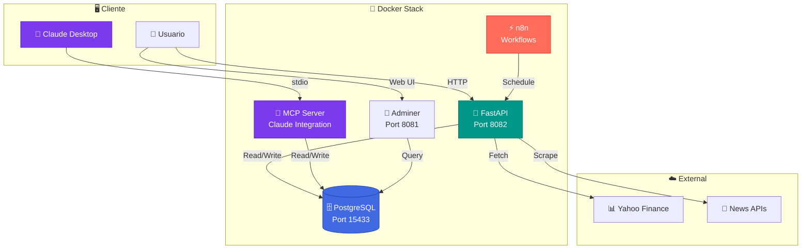
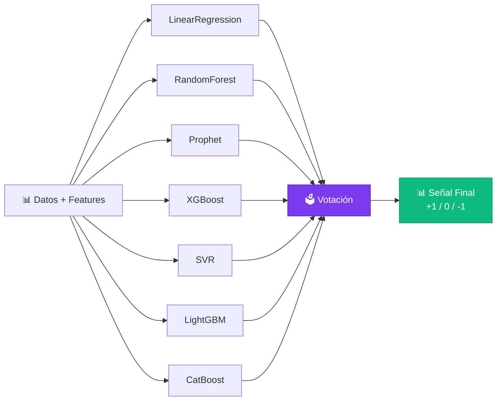
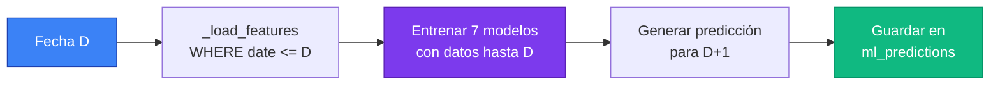

<div align="center">

# 📈 PID Bolsa

### Sistema Inteligente de Predicción de Mercados Financieros

[](https://www.docker.com/)
[](https://www.python.org/)
[](https://fastapi.tiangolo.com/)
[](https://www.postgresql.org/)
[](https://modelcontextprotocol.io/)
[](LICENSE)

*Predicción de mercados financieros mediante Machine Learning, automatización inteligente y análisis conversacional con IA*

[Características](#-características) • [Instalación](#-instalación-rápida) • [Arquitectura](#-arquitectura) • [API](#-api-rest) • [Machine Learning](#-machine-learning) • [MCP](#-integración-con-claude-desktop) • [Documentación](#-documentación-completa)

</div>

---

## 🚀 Características

### 🤖 Machine Learning & Predicción

- **Ensemble de 7 Modelos ML**: LinearRegression, RandomForest, Prophet, XGBoost, SVR, LightGBM, CatBoost
- **Votación Inteligente**: Señales de trading (+1, 0, -1) por consenso de modelos
- **Validación Automática**: Backtesting diario comparando predicciones vs valores reales
- **Backfill Histórico**: Generación de predicciones históricas sin look-ahead bias para análisis retrospectivo
- **Hyperparameter Tuning**: Grid search o Bayesian optimization, auto-reentrenamiento con mejores parámetros, configuraciones optimizadas por mercado
- **Almacenamiento Persistente**: Modelos entrenados guardados para reutilización

### 📊 Análisis de Mercados

- **3 Índices Principales**: IBEX35 (España), S&P500 (USA), NIKKEI (Japón)
- **Cobertura Global**: Europa, América, Asia-Pacífico
- **Indicadores Técnicos**: SMA(20/50), RSI(14), Volatilidad, Retornos
- **Análisis de Noticias**: Dual-source (Yahoo Finance + Google RSS) con soporte para estructuras múltiples
- **Datos Históricos**: Precios OHLCV desde Yahoo Finance

### 🔄 Automatización & Orquestación

- **n8n Workflows**: Pipelines ETL automáticos para ingesta y procesamiento
- **Programación Diaria**: Actualización automática de datos, indicadores y predicciones
- **Reportes Automáticos**: Generación de resúmenes diarios por mercado

### 🐳 Arquitectura Cloud-Native

- **Docker Compose**: Stack completo con un solo comando
- **Microservicios**: PostgreSQL, FastAPI, n8n, Adminer
- **Docker Optimizado**: Imagen MCP pre-construida con todas las dependencias
- **Volúmenes Persistentes**: Datos y modelos sobreviven reinicios

### 💬 Integración con IA Conversacional

- **Model Context Protocol (MCP)**: Servidor MCP para Claude Desktop
- **7 Herramientas Conversacionales**: Consulta precios, predicciones, indicadores, noticias via chat
- **Análisis en Tiempo Real**: Pregunta a Claude sobre mercados en lenguaje natural
- **Ejecución Dockerizada**: MCP server aislado con todas las dependencias

## 🏗️ Arquitectura



### 📦 Stack Tecnológico

| Componente | Tecnología | Puerto | Función |
|------------|------------|--------|---------|
| **Base de Datos** | PostgreSQL 15 | 15433 | Almacenamiento de precios, indicadores, predicciones |
| **API REST** | FastAPI + Uvicorn | 8082 | Endpoints para ETL, ML, reporting |
| **MCP Server** | Python + MCP SDK | stdio | Integración con Claude Desktop |
| **Automatización** | n8n | 5678 | Workflows programados y ETL |
| **Admin DB** | Adminer | 8081 | Interfaz web para gestión de BD |
| **ML Models** | scikit-learn, XGBoost, Prophet | - | Ensemble de 7 modelos |
| **Containerización** | Docker + Docker Compose | - | Orquestación completa |

## 📦 Componentes del Sistema

### 🗄️ Base de Datos (PostgreSQL 15)

**Puerto**: 15433 | **Credenciales**: finanzas/finanzas_pass

#### Schema

| Tabla | Descripción | Campos Clave |
|-------|-------------|--------------|
| `prices` | Datos históricos OHLCV | symbol, date, open, high, low, close, volume |
| `indicators` | Indicadores técnicos | symbol, date, sma_20, sma_50, rsi_14, volatility_20 |
| `signals` | Señales de trading | symbol, date, signal (-1, 0, +1) |
| `news` | Noticias financieras | symbol, title, url, published_at, sentiment |
| `ml_predictions` | Predicciones ML | symbol, prediction_date, model_name, predicted_value, true_value, error_abs |

#### Gestión con Adminer

Accede a **http://localhost:8081** para:
- Explorar tablas y datos
- Ejecutar consultas SQL
- Exportar/importar datos
- Ver estructura de BD

### 🚀 API REST (FastAPI)

**Puerto**: 8082 | **Docs**: http://localhost:8082/docs

Servidor de alto rendimiento con:
- **20+ endpoints** para ETL, ML y reporting
- **Documentación interactiva** (Swagger UI)
- **Validación automática** con Pydantic
- **Respuestas rápidas** con caché en memoria

### 💬 MCP Server (Claude Integration)

**Protocolo**: stdio | **Docker**: Imagen optimizada pre-construida

Servidor especializado que:
- Expone **7 herramientas** a Claude Desktop
- Ejecuta en **entorno Docker aislado**
- Accede a **misma BD** que API REST
- Permite **análisis conversacional** en lenguaje natural

[Ver documentación completa →](docs/mcp/README.md)

### ⚡ n8n (Automatización)

**Puerto**: 5678 | **Credenciales**: admin/admin123

Plataforma de automatización para:
- **Workflows programados** (cron jobs)
- **Pipelines ETL** automáticos
- **Integración** con servicios externos
- **Generación de reportes** PDF/Email

Workflows predefinidos:
1. 🌅 **Daily Update** (8:00 AM): Descarga precios y noticias
2. 📊 **Compute Indicators** (8:30 AM): Calcula indicadores técnicos
3. 🤖 **ML Prediction** (9:00 AM): Ejecuta ensemble y guarda predicción
4. ✅ **Validation** (9:30 AM): Valida predicciones del día anterior
5. 📧 **Daily Report** (10:00 AM): Envía resumen diario

## 🚀 Instalación Rápida

### Prerrequisitos

```bash
# Verificar instalaciones
docker --version          # Docker 20.10+
docker-compose --version  # Docker Compose 2.0+
python3 --version         # Python 3.11+ (opcional, para desarrollo)
```

### Opción 1: Docker Compose (Recomendado)

```bash
# 1. Clonar el repositorio
git clone https://github.com/acastc03/PID_bolsa.git
cd PID_bolsa

# 2. Configurar variables de entorno (opcional, hay valores por defecto)
cp .env.example .env

# 3. Iniciar todos los servicios
docker-compose up -d

# 4. Verificar que todo está corriendo
docker-compose ps

# 5. Ver logs en tiempo real
docker-compose logs -f mcp
```

**✅ ¡Listo!** Los servicios estarán disponibles en:
- 🚀 API REST: http://localhost:8082/docs
- 🗄️ Adminer: http://localhost:8081
- ⚡ n8n: http://localhost:5678

### Opción 2: Desarrollo Local

```bash
# 1. Crear entorno virtual
python3 -m venv venv
source venv/bin/activate  # En Windows: venv\Scripts\activate

# 2. Instalar dependencias
pip install -r mcp_server/requirements.txt

# 3. Iniciar solo la base de datos
docker-compose up -d db

# 4. Ejecutar el servidor localmente
cd mcp_server
uvicorn app.main:app --reload --port 8082
```

### Configuración Inicial

El archivo `.env` contiene las configuraciones principales:

```env
# Puertos expuestos
POSTGRES_PORT=15433
N8N_PORT=5678
MCP_PORT=8082

# Credenciales de BD
POSTGRES_USER=finanzas
POSTGRES_PASSWORD=finanzas_pass
POSTGRES_DB=indices
MCP_DB_NAME=indices
```

### Verificación de Instalación

```bash
# Estado de contenedores
docker-compose ps

# Salud de la API
curl http://localhost:8082/health

# Conexión a PostgreSQL
docker exec -it db_finanzas psql -U finanzas -d indices -c "\dt"

# Ver logs
docker-compose logs --tail=50 mcp
```

## 📡 API REST

### 📖 Documentación Interactiva

La API incluye documentación completa con **Swagger UI** y **ReDoc**:

- **Swagger UI**: http://localhost:8082/docs
- **ReDoc**: http://localhost:8082/redoc
- **OpenAPI JSON**: http://localhost:8082/openapi.json

### 🔥 Quick Start

#### Pipeline Completo - IBEX35

```bash
# 1. Actualizar precios (último mes)
curl "http://localhost:8082/update_prices?market=ibex35&period=1mo"

# 2. Actualizar noticias (última semana)
curl "http://localhost:8082/update_news?markets=IBEX35&days=7"

# 3. Calcular indicadores técnicos
curl "http://localhost:8082/compute_indicators?market=ibex35"

# 4. Generar señales de trading
curl "http://localhost:8082/compute_signals?market=ibex35"

# 5. Predicción ML (ensemble de 7 modelos)
curl "http://localhost:8082/predecir_ensemble?symbol=^IBEX"

# 6. Resumen diario completo
curl "http://localhost:8082/daily_summary?market=ibex35"
```

### 📊 Endpoints por Categoría

#### 🔄 ETL - Ingesta de Datos

```bash
# Actualizar precios (períodos: 1d, 5d, 1mo, 3mo, 6mo, 1y)
GET /update_prices?market=ibex35&period=1mo

# Actualizar noticias de múltiples mercados
GET /update_news?markets=IBEX35,SP500,NASDAQ&days=7
```

#### 📈 ETL - Indicadores y Señales

```bash
# Calcular indicadores técnicos (SMA, RSI, Volatilidad)
GET /compute_indicators?market=ibex35

# Generar señales de trading (+1, 0, -1)
GET /compute_signals?market=ibex35
```

#### 🤖 Machine Learning

```bash
# Predicción simple basada en reglas
GET /predecir_simple?symbol=^IBEX

# Predicción ensemble (7 modelos ML + votación)
GET /predecir_ensemble?symbol=^IBEX

# Forzar reentrenamiento de modelos
POST /retrain_models?symbol=^IBEX

# Validar predicciones del día anterior
POST /validate_predictions

# Validar predicciones de fecha específica
POST /validate_predictions?date_str=2025-12-01
```

#### 📋 Reporting y Análisis

```bash
# Resumen diario completo del mercado
GET /daily_summary?market=ibex35

# Información de modelos ML guardados
GET /model_info?symbol=^IBEX

# Health check
GET /health
```

### 📝 Ejemplos con Python

```python
import requests

BASE_URL = "http://localhost:8082"

# Obtener precio actual
response = requests.get(f"{BASE_URL}/update_prices", params={
    "market": "ibex35",
    "period": "1d"
})
print(response.json())

# Predicción ML
response = requests.get(f"{BASE_URL}/predecir_ensemble", params={
    "symbol": "^IBEX"
})
prediction = response.json()
print(f"Señal: {prediction['señal_final']}")
print(f"Consenso: {prediction['consenso']}")

# Resumen diario
response = requests.get(f"{BASE_URL}/daily_summary", params={
    "market": "ibex35"
})
summary = response.json()
print(summary['formatted_report'])
```

## 💬 Integración con Claude Desktop

### ¿Qué es MCP?

**Model Context Protocol (MCP)** permite que Claude Desktop acceda a herramientas externas en tiempo real. Con esta integración, puedes analizar mercados financieros mediante conversación natural.

### 🚀 Setup en 3 Pasos

#### 1. Construir la imagen Docker del MCP Server

```bash
cd PID_bolsa
docker build -t mcp-finance-server:latest -f mcp_server_claude/Dockerfile .
```

#### 2. Configurar Claude Desktop

**macOS:** Edita `~/Library/Application Support/Claude/claude_desktop_config.json`

**Windows:** Edita `%APPDATA%\Claude\claude_desktop_config.json`

```json
{
  "mcpServers": {
    "finance-predictor": {
      "command": "/ruta/completa/PID_bolsa/mcp_server_claude/run_docker_optimized.sh",
      "args": []
    }
  }
}
```

#### 3. Reiniciar Claude Desktop

Cierra completamente Claude Desktop (Cmd/Ctrl+Q) y vuelve a abrirlo.

### 🎯 Herramientas Disponibles

Una vez configurado, Claude tendrá acceso a estas 7 herramientas:

| Herramienta | Descripción |
|-------------|-------------|
| `get_market_price` | Obtiene el último precio disponible (OHLCV) |
| `get_prediction` | Predicción ML mediante ensemble de 7 modelos |
| `get_indicators` | Indicadores técnicos (SMA, RSI, Volatilidad) |
| `get_news` | Últimas noticias financieras del mercado |
| `update_market_data` | Actualiza precios desde Yahoo Finance |
| `get_daily_summary` | Resumen completo del día (precio, indicadores, señales, noticias) |
| `validate_predictions` | Valida predicciones del día anterior vs valores reales |

### 💬 Ejemplos de Uso

Una vez configurado, puedes preguntarle a Claude:

```
🗣️ "¿Tienes acceso a herramientas financieras?"
→ Claude confirmará que tiene 7 herramientas disponibles

🗣️ "¿Cuál es el precio actual del IBEX35?"
→ Claude usará get_market_price y te mostrará OHLCV

🗣️ "Dame la predicción ML para el S&P 500"
→ Claude ejecutará get_prediction con ensemble de 7 modelos

🗣️ "Muéstrame el resumen diario completo del NASDAQ"
→ Claude generará análisis con precio, indicadores, señales y noticias

🗣️ "¿Qué noticias recientes hay sobre el NIKKEI?"
→ Claude obtendrá las últimas noticias financieras

🗣️ "Actualiza los datos del IBEX35 del último mes"
→ Claude descargará datos históricos actualizados
```

### 📚 Documentación Completa

📖 **[Ver toda la documentación en /docs](docs/)**

#### 🤖 Integración con IA
- **[MCP Setup](docs/mcp/README.md)** - Integración con Claude Desktop
- **[Docker Setup](docs/mcp/DOCKER_SETUP.md)** - Configuración Docker (macOS/Linux/Windows)
- **[Ejemplos MCP](docs/mcp/EJEMPLOS.md)** - Casos de uso conversacionales
- **[Guía MCP Completa](docs/mcp/GUIA_COMPLETA.md)** - Arquitectura y troubleshooting

#### 📊 Machine Learning
- **[Backfill de Predicciones](BACKFILL_README.md)** - Predicciones históricas sin look-ahead bias
- **[Requirements](docs/REQUIREMENTS.md)** - Gestión de dependencias Python

### 🐳 Opciones de Ejecución

| Método | Tiempo inicio | Aislamiento | Recomendado para |
|--------|---------------|-------------|-------------------|
| **Docker Optimizado** | ~2s | ✅ | Producción / Demo |
| **Docker Simple** | ~15s | ✅ | Testing |
| **Directo (Python)** | <1s | ❌ | Desarrollo |

---

## 🔧 Desarrollo Local

### Instalar Dependencias

```bash
# Crear entorno virtual
python3 -m venv PID
source PID/bin/activate

# Instalar dependencias
pip install -r mcp_server/requirements.txt
```

### Ejecutar el Servidor MCP Localmente

```bash
cd mcp_server
uvicorn app.main:app --reload --host 0.0.0.0 --port 8000
```

### Script de Descarga Manual

```bash
python download_ibex.py
```

Esto descargará los datos del IBEX35 en `./data/^IBEX_prices.csv`.

## 🤖 Machine Learning

### Arquitectura de Ensemble

El sistema implementa un **ensemble de 7 modelos** con votación mayoritaria:



### Modelos Implementados

| Modelo | Tipo | Ventajas | Parámetros Clave |
|--------|------|----------|------------------|
| **Linear Regression** | Baseline | Simple, interpretable | - |
| **Random Forest** | Tree Ensemble | Robusto, no requiere normalización | n_estimators=100 |
| **Prophet** | Time Series | Maneja estacionalidad y tendencias | daily_seasonality=True |
| **XGBoost** | Gradient Boosting | Alta precisión, rápido | max_depth=5, learning_rate=0.1 |
| **SVR** | Kernel Methods | Efectivo en espacios de alta dimensión | kernel='rbf', C=1.0 |
| **LightGBM** | Gradient Boosting | Muy rápido, eficiente con memoria | num_leaves=31 |
| **CatBoost** | Gradient Boosting | Maneja categorías automáticamente | iterations=100 |

### Feature Engineering

#### Features Base (Precios OHLCV)
- `Open`, `High`, `Low`, `Close`, `Volume`

#### Indicadores Técnicos
- **SMA(20)**: Media móvil simple de 20 días
- **SMA(50)**: Media móvil simple de 50 días
- **RSI(14)**: Relative Strength Index (0-100)
- **Volatilidad(20)**: Desviación estándar de retornos

#### Features Temporales
- `day_of_week`: Lunes=0, Viernes=4
- `month`: 1-12
- `return_1d`: Retorno del día anterior

### Señales de Trading

El sistema genera 3 tipos de señales:

| Señal | Valor | Significado | Acción |
|-------|-------|-------------|--------|
| 🟢 COMPRA | +1 | Precio subirá | Abrir posición larga |
| 🟡 NEUTRAL | 0 | Sin movimiento claro | Mantener posición |
| 🔴 VENTA | -1 | Precio bajará | Cerrar posición / Short |

### Proceso de Votación

1. Cada modelo predice señal independientemente: +1, 0, o -1
2. Se cuentan los votos para cada señal
3. **Mayoría simple** determina señal final
4. **Consenso** = (votos_mayoria / 7) × 100%

**Ejemplo:**
```
LinearRegression: +1
RandomForest:     +1
Prophet:          +1
XGBoost:          +1
SVR:              0
LightGBM:         +1
CatBoost:         +1

Señal Final: +1 (COMPRA)
Consenso: 85.7% (6/7 modelos)
```

### Validación y Backtesting

- **Validación Diaria**: Compara predicciones del día anterior vs precio real
- **Métricas**: Error absoluto, error porcentual
- **Almacenamiento**: Todas las predicciones se guardan en `ml_predictions`
- **Tracking**: Performance individual por modelo y por mercado

### 🔄 Backfill de Predicciones Históricas

El sistema incluye funcionalidad para **generar predicciones históricas sin look-ahead bias**, útil para:
- ✅ Análisis de rendimiento histórico de modelos
- ✅ Llenar datos faltantes si el sistema estuvo caído
- ✅ Backtesting de estrategias de trading
- ✅ Evaluación de modelos en períodos específicos

#### Características del Backfill

El script implementa **filtrado temporal estricto** para evitar información del futuro:

```python
# Para cada fecha histórica D:
predict_ensemble(symbol, as_of_date=D, force_retrain=True)
# ✅ Solo usa datos disponibles hasta fecha D
# ✅ Reentrena modelos con datos históricos correctos
# ✅ Sin look-ahead bias
```

**Flujo del Backfill:**



#### Cómo Usar

**Opción 1: Script Helper (Recomendado)**
```bash
./run_backfill.sh
```

**Opción 2: Directo desde Docker**
```bash
docker exec -it mcp_finance python -m scripts.backfill_predictions
```

**Opción 3: Personalizado en Python**
```python
from scripts.backfill_predictions import backfill_predictions_for_symbol
from datetime import date

# Backfill para IBEX35 (1-10 diciembre 2024)
backfill_predictions_for_symbol(
    symbol="^IBEX",
    start_date=date(2024, 12, 1),
    end_date=date(2024, 12, 10)
)
```

#### Consideraciones Importantes

⚠️ **Rendimiento**: El backfill reentrena 7 modelos ML por cada fecha, lo que puede tardar varios minutos por día.

⚠️ **Requisitos**: Deben existir datos de precios e indicadores para todas las fechas del rango.

⚠️ **Ejecución**: Solo funciona dentro del contenedor Docker (requiere `DB_HOST=db`).

✅ **Validación**: Después del backfill, valida los resultados:
```bash
# Validar predicciones de una fecha específica
curl "http://localhost:8082/validate_predictions?date_str=2024-12-05"

# Analizar rendimiento en un rango
curl "http://localhost:8082/model_performance?symbol=^IBEX&days=30"
```

📚 **Documentación completa**: Ver `BACKFILL_README.md` para detalles técnicos sobre la implementación.

## 🗂️ Estructura del Proyecto

```
PID_bolsa/
├── docker-compose.yml          # Orquestación de servicios
├── .env                        # Variables de entorno
├── download_ibex.py           # Script de descarga manual
├── requests.http              # Ejemplos de peticiones HTTP
├── data/                      # Datos persistentes
│   ├── db/                    # Volumen PostgreSQL
│   └── models/                # Modelos ML guardados
├── db-init/                   # Scripts de inicialización BD
│   ├── 01_init.sql           # Tablas principales
│   └── 02_ml_predictions.sql # Tabla de predicciones
├── mcp_server/               # API FastAPI
│   ├── Dockerfile
│   ├── requirements.txt
│   ├── app/
│   │   ├── __init__.py
│   │   └── main.py          # Endpoints FastAPI
│   └── scripts/             # Módulos de lógica
│       ├── assets.py        # Resolución de símbolos
│       ├── fetch_data.py    # Descarga de precios
│       ├── indicators.py    # Cálculo de indicadores
│       ├── models.py        # Modelos ML
│       ├── news.py          # Scraping de noticias
│       ├── save_predictions.py    # Persistencia de predicciones
│       ├── validate_predictions.py # Validación de modelos
│       ├── reporting.py     # Generación de reportes
│       └── model_storage.py # Gestión de modelos
├── n8n/                      # Datos de n8n
└── PID/                      # Entorno virtual Python
```

## 🔄 Workflow Diario Recomendado

### Configurar en n8n o ejecutar manualmente:

1. **08:00** - Actualizar precios de mercados
   ```bash
   curl "http://localhost:8080/update_prices?market=ibex35&period=5d"
   ```

2. **08:05** - Descargar noticias recientes
   ```bash
   curl "http://localhost:8080/update_news?markets=IBEX35,SP500&days=1"
   ```

3. **08:10** - Calcular indicadores técnicos
   ```bash
   curl "http://localhost:8080/compute_indicators?market=ibex35"
   ```

4. **08:15** - Generar señales de trading
   ```bash
   curl "http://localhost:8080/compute_signals?market=ibex35"
   ```

5. **08:20** - Reentrenar modelos y hacer predicción
   ```bash
   curl "http://localhost:8080/retrain_models?symbol=^IBEX"
   ```

6. **08:25** - Validar predicciones del día anterior
   ```bash
   curl -X POST "http://localhost:8080/validate_predictions"
   ```

7. **08:30** - Generar reporte diario
   ```bash
   curl "http://localhost:8080/daily_summary?market=ibex35"
   ```

## 🛠️ Mantenimiento

### Ver Logs

```bash
# Logs de todos los servicios
docker-compose logs -f

# Logs de un servicio específico
docker-compose logs -f mcp
docker-compose logs -f db
docker-compose logs -f n8n
```

### Backup de la Base de Datos

```bash
docker exec db_finanzas pg_dump -U finanzas indices > backup_$(date +%Y%m%d).sql
```

### Restaurar Backup

```bash
docker exec -i db_finanzas psql -U finanzas indices < backup_20251126.sql
```

### Limpiar Modelos Antiguos

Los modelos se limpian automáticamente manteniendo los últimos 7 días. Para limpiar manualmente:

```bash
curl "http://localhost:8080/retrain_models?symbol=^IBEX"
```

### Reiniciar Servicios

```bash
# Reiniciar todos los servicios
docker-compose restart

# Reiniciar un servicio específico
docker-compose restart mcp
```

### Detener y Eliminar Todo

```bash
docker-compose down

# Eliminar también los volúmenes (⚠️ BORRA TODOS LOS DATOS)
docker-compose down -v
```

## 📊 Gestión de Base de Datos

### Acceder con Adminer

1. Ir a `http://localhost:8081`
2. Ingresar credenciales:
   - **Sistema**: PostgreSQL
   - **Servidor**: db
   - **Usuario**: finanzas
   - **Contraseña**: finanzas_pass
   - **Base de datos**: indices

### Consultas Útiles

```sql
-- Ver últimos precios
SELECT * FROM prices WHERE symbol = '^IBEX' ORDER BY date DESC LIMIT 10;

-- Ver indicadores recientes
SELECT * FROM indicators WHERE symbol = '^IBEX' ORDER BY date DESC LIMIT 10;

-- Ver señales generadas
SELECT * FROM signals WHERE symbol = '^IBEX' ORDER BY date DESC LIMIT 10;

-- Ver predicciones ML con errores
SELECT 
    prediction_date,
    model_name,
    predicted_value,
    true_value,
    error_abs,
    CASE 
        WHEN true_value IS NOT NULL 
        THEN ABS(error_abs / true_value) * 100 
    END as error_percent
FROM ml_predictions 
WHERE symbol = '^IBEX' 
    AND true_value IS NOT NULL
ORDER BY prediction_date DESC, model_name;

-- Comparar rendimiento de modelos
SELECT 
    model_name,
    COUNT(*) as predictions,
    AVG(error_abs) as avg_error,
    AVG(ABS(error_abs / true_value) * 100) as avg_error_percent
FROM ml_predictions
WHERE symbol = '^IBEX' 
    AND true_value IS NOT NULL
GROUP BY model_name
ORDER BY avg_error;

-- Ver noticias recientes
SELECT * FROM news WHERE symbol = '^IBEX' ORDER BY published_at DESC LIMIT 10;
```

## 🔐 Seguridad

⚠️ **IMPORTANTE**: Este proyecto es para uso educativo/desarrollo.

Para producción:
- Cambiar credenciales por defecto en `.env`
- Usar secrets de Docker en lugar de variables de entorno
- Configurar HTTPS con certificados SSL
- Implementar autenticación JWT en la API
- Configurar firewall y limitar acceso a puertos

## 🐛 Solución de Problemas

### Error: "Puerto ya en uso"

Cambiar los puertos en `.env`:
```env
POSTGRES_PORT=15434
N8N_PORT=5679
MCP_PORT=8081
```

### Error: "No se puede conectar a la base de datos"

1. Verificar que PostgreSQL esté corriendo:
   ```bash
   docker-compose ps
   ```

2. Verificar logs:
   ```bash
   docker-compose logs db
   ```

3. Reiniciar el servicio:
   ```bash
   docker-compose restart db
   ```

### Error: "Modelos ML no se entrenan"

Verificar que haya suficientes datos:
```sql
SELECT COUNT(*) FROM prices WHERE symbol = '^IBEX';
SELECT COUNT(*) FROM indicators WHERE symbol = '^IBEX';
```

Se necesitan al menos 60 días de datos históricos para entrenar correctamente.

### Limpiar y Reiniciar

```bash
# Detener todo
docker-compose down

# Eliminar volúmenes (⚠️ borra datos)
docker-compose down -v

# Reconstruir imágenes
docker-compose build --no-cache

# Iniciar de nuevo
docker-compose up -d
```

## 📈 Mercados Soportados

| Mercado | Símbolo | Descripción |
|---------|---------|-------------|
| IBEX35 | ^IBEX | Índice español |
| SP500 | ^GSPC | S&P 500 (USA) |
| NASDAQ | ^IXIC | NASDAQ Composite |
| NIKKEI | ^N225 | Nikkei 225 (Japón) |

## 📊 Resultados y Performance

### Métricas del Sistema

```sql
-- Ver performance de modelos
SELECT 
    model_name,
    COUNT(*) as predictions,
    AVG(error_abs) as avg_error,
    AVG(ABS(error_abs / true_value) * 100) as avg_error_percent
FROM ml_predictions
WHERE symbol = '^IBEX' AND true_value IS NOT NULL
GROUP BY model_name
ORDER BY avg_error;
```

### Datos Disponibles

- **Mercados**: 4 índices globales
- **Precios Históricos**: Desde 2020 hasta presente
- **Indicadores**: Actualizados diariamente
- **Noticias**: ~50 noticias por mercado/semana
- **Predicciones**: Almacenadas con timestamp y validación

## 🛠️ Desarrollo y Extensión

### Estructura del Proyecto

```
PID_bolsa/
├── 📄 docker-compose.yml          # Orquestación completa
├── 📄 .env                        # Variables de entorno
├── 📄 README.md                   # Este archivo
├── 📄 download_ibex.py            # Script standalone
├── 📁 data/
│   ├── db/                        # PostgreSQL data
│   └── models/                    # Modelos ML guardados
├── 📁 db-init/
│   ├── 01_init.sql               # Schema principal
│   └── 02_ml_predictions.sql     # Tabla predicciones
├── 📁 mcp_server/                 # API FastAPI
│   ├── Dockerfile
│   ├── requirements.txt
│   ├── app/
│   │   └── main.py               # Endpoints FastAPI
│   └── scripts/
│       ├── assets.py             # Resolución símbolos
│       ├── config.py             # Conexión DB
│       ├── fetch_data.py         # Yahoo Finance
│       ├── indicators.py         # Cálculo técnicos
│       ├── models.py             # Ensemble ML
│       ├── news.py               # Scraping noticias
│       ├── save_predictions.py   # Persistencia
│       ├── validate_predictions.py # Backtesting
│       ├── reporting.py          # Reportes
│       └── model_storage.py      # Gestión modelos
├── 📁 mcp_server_claude/          # Integración Claude
│   ├── server.py                 # MCP Server
│   ├── Dockerfile                # Imagen Docker
│   ├── run_docker_optimized.sh   # Script ejecución
│   ├── README.md                 # Guía integración
│   ├── DOCKER_SETUP.md           # Setup Docker
│   ├── EJEMPLOS.md               # Ejemplos uso
│   └── GUIA_COMPLETA.md          # Guía completa
└── 📁 n8n/                        # Workflows n8n
```

### Testing Local

```bash
# Ejecutar tests de integración
pytest tests/ -v

# Verificar cobertura
pytest --cov=mcp_server tests/

# Linting
flake8 mcp_server/
black mcp_server/
```

### Añadir Nuevo Modelo ML

```python
# En mcp_server/scripts/models.py

from sklearn.ensemble import GradientBoostingClassifier

def train_nuevo_modelo(X_train, y_train):
    model = GradientBoostingClassifier(
        n_estimators=100,
        learning_rate=0.1,
        max_depth=5
    )
    model.fit(X_train, y_train)
    return model

# Añadir al ensemble en predict_ensemble()
modelos['NuevoModelo'] = train_nuevo_modelo(X_train, y_train)
```

### Añadir Nuevo Indicador

```python
# En mcp_server/scripts/indicators.py

def calculate_nuevo_indicador(df):
    """
    Calcula un nuevo indicador técnico.
    
    Args:
        df: DataFrame con columnas OHLCV
    
    Returns:
        DataFrame con columna 'nuevo_indicador'
    """
    df['nuevo_indicador'] = df['close'].rolling(window=14).mean()
    return df
```

## 🚀 Roadmap

### ✅ Completado

- [x] Ingesta automática de datos (yfinance)
- [x] Cálculo de indicadores técnicos
- [x] Ensemble de 7 modelos ML
- [x] API REST con FastAPI
- [x] Dockerización completa
- [x] Integración con Claude Desktop (MCP)
- [x] Documentación completa

### 🔄 En Progreso

- [ ] Dashboard web con Streamlit
- [ ] Sistema de alertas (Telegram bot)
- [ ] Backtesting automatizado con métricas

### 📋 Próximas Mejoras

- [ ] Paper trading simulator
- [ ] Hyperparameter tuning automático
- [ ] Más indicadores técnicos (MACD, Bollinger, ADX)
- [ ] Sentiment analysis con NLP
- [ ] CI/CD con GitHub Actions
- [ ] Tests unitarios completos
- [ ] Integración con brokers (Alpaca, IB)

## 📄 Licencia

Este proyecto está bajo la licencia MIT. Ver [LICENSE](LICENSE) para más detalles.

## 👥 Contribuciones

Las contribuciones son bienvenidas! Por favor:

1. Fork el proyecto
2. Crea tu feature branch (`git checkout -b feature/AmazingFeature`)
3. Commit tus cambios (`git commit -m 'Add some AmazingFeature'`)
4. Push a la rama (`git push origin feature/AmazingFeature`)
5. Abre un Pull Request

### Guías de Contribución

- Sigue PEP 8 para código Python
- Añade docstrings a todas las funciones
- Incluye tests para nuevas features
- Actualiza la documentación según corresponda

## 📞 Soporte

¿Necesitas ayuda?

- 📖 [Documentación API](http://localhost:8082/docs)
- 🐛 [Reportar un Bug](https://github.com/acastc03/PID_bolsa/issues)
- 💬 [Discusiones](https://github.com/acastc03/PID_bolsa/discussions)
- 📧 Email: [tu-email@ejemplo.com]

## 🙏 Agradecimientos

- [Yahoo Finance](https://finance.yahoo.com/) - Datos de mercado
- [FastAPI](https://fastapi.tiangolo.com/) - Framework web
- [n8n](https://n8n.io/) - Automatización de workflows
- [Model Context Protocol](https://modelcontextprotocol.io/) - Integración IA
- [scikit-learn](https://scikit-learn.org/) - Machine Learning

## 📊 Stack Completo

**Backend**: Python 3.11, FastAPI, Uvicorn
**Database**: PostgreSQL 15
**ML**: scikit-learn, XGBoost, LightGBM, CatBoost, Prophet
**Data**: yfinance, pandas, numpy
**Automation**: n8n
**Containerization**: Docker, Docker Compose
**AI Integration**: Model Context Protocol (MCP)
**API Docs**: Swagger UI, ReDoc

---

<div align="center">

**⭐ Si este proyecto te resulta útil, considera darle una estrella en GitHub ⭐**

Desarrollado con ❤️ para el curso de **Ingeniería de Datos**

[🏠 Inicio](#-pid-bolsa) • [📖 Documentación](#-documentación) • [🚀 Instalación](#-instalación-rápida) • [💬 Claude](#-integración-con-claude-desktop) • [🤝 Contribuir](#-contribuciones)

</div>
