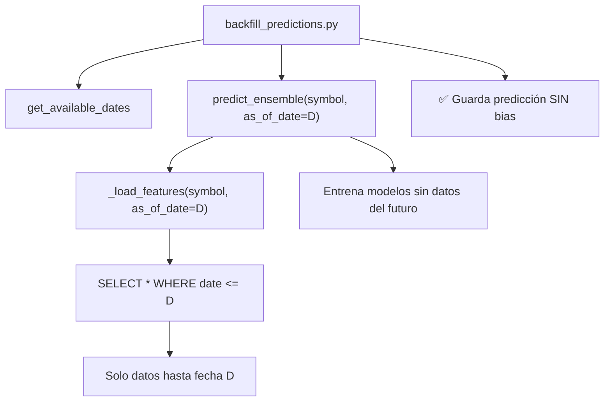

# 📊 Backfill de Predicciones - Guía Completa

**Última actualización: 10 diciembre 2025**

## ✅ Estado: PROBLEMA RESUELTO

El sistema de backfill ahora funciona **correctamente sin look-ahead bias**.

---

## 🔧 Solución Implementada

Se agregó soporte para `as_of_date` en todo el pipeline de predicciones:

### Cambios realizados:

1. **`_load_features(symbol, as_of_date=None)`**
   - Nuevo parámetro opcional `as_of_date`
   - Filtra datos con `WHERE p.date <= as_of_date`
   - Sin el parámetro, comportamiento original (todos los datos)

2. **`predict_ensemble(symbol, force_retrain=False, as_of_date=None)`**
   - Nuevo parámetro opcional `as_of_date`
   - Si se especifica, fuerza `force_retrain=True` automáticamente
   - Previene usar modelos guardados que se entrenaron con datos del futuro

3. **`backfill_predictions_for_symbol()` actualizado**
   - Ahora llama a `predict_ensemble(symbol, as_of_date=prediction_date, force_retrain=True)`
   - Cada fecha usa SOLO datos disponibles hasta ese momento
   - ✅ Sin información del futuro

---

## ❌ Problema Original (YA RESUELTO)

### 1. **Look-Ahead Bias (RESUELTO)**

El script `backfill_predictions.py` tiene un **fallo fundamental de diseño**:

```python
# Para cada fecha histórica D:
for d in dates:
    prediction_date = d
    result = predict_ensemble(symbol)  # ❌ USA TODOS LOS DATOS HASTA HOY
    save_predictions(...)
```

**Problema**: `predict_ensemble()` llama a `_load_features()` que carga **TODOS** los datos históricos sin filtrar por fecha. Esto significa que cuando "predecimos" el 1 de diciembre de 2024, estamos usando información de diciembre, enero, febrero... **del futuro**.

**Resultado**: Las predicciones históricas parecerán artificialmente buenas porque tienen información que no deberían tener.

### 2. **Error de Conexión (Problema Técnico)**

```bash
$ python3 mcp_server/scripts/backfill_predictions.py
❌ Error: could not translate host name "db" to address
```

**Causa**: El script intenta conectarse a `DB_HOST=db` (nombre del servicio Docker), pero si lo ejecutas fuera del contenedor, ese hostname no existe.

**Solución**: Ejecutar DENTRO del contenedor:
```bash
docker exec -it mcp_finance python -m scripts.backfill_predictions
```

O usar el script helper:
```bash
./run_backfill.sh
```

## 🔧 Cómo funciona AHORA (Correcto)



### Flujo detallado:

```python
# Para cada fecha histórica D en el rango:
for d in dates:
    # 1. predict_ensemble recibe as_of_date
    result = predict_ensemble(symbol, as_of_date=d, force_retrain=True)
    
    # 2. _load_features filtra datos
    df = _load_features(symbol, as_of_date=d)
    # SQL: WHERE p.date <= d  ✅
    
    # 3. Modelos se entrenan SOLO con datos <= d
    # 4. Predicción se hace sin información del futuro
    
    # 5. Guardar predicción válida
    save_daily_predictions(symbol, prediction_date=d, ...)
```

## 📖 Uso del Sistema (ACTUALIZADO)

### ✅ Ahora puedes usar backfill de forma segura para:

1. ✅ **Análisis de rendimiento histórico** - Las predicciones son válidas
2. ✅ **Llenar datos faltantes** - Si el sistema estuvo caído
3. ✅ **Backtesting de estrategias** - Sin información del futuro
4. ✅ **Evaluación de modelos** - Resultados comparables con producción

### ⚠️ Consideraciones de rendimiento:

- El backfill **reentrena modelos ML para cada fecha** (force_retrain=True)
- Esto es necesario para evitar usar modelos entrenados con datos del futuro
- Puede ser **lento para rangos grandes** (varios minutos por fecha)
- Recomendado: Rangos pequeños (días/semanas, no meses)

## 📝 Cómo usar el script

### Desde fuera del contenedor:
```bash
./run_backfill.sh
```

### Desde dentro del contenedor:
```bash
docker exec -it mcp_finance bash
cd /app
python -m scripts.backfill_predictions
```

### Modificar fechas:
Edita `backfill_predictions.py`:
```python
if __name__ == "__main__":
    symbol = "^IBEX"
    start = date(2024, 12, 1)  # Cambiar aquí
    end = date(2024, 12, 10)   # Cambiar aquí
    backfill_predictions_for_symbol(symbol, start_date=start, end_date=end)
```

### Desde Python directamente (dentro del contenedor):
```python
from scripts.backfill_predictions import backfill_predictions_for_symbol
from datetime import date

# Backfill para IBEX35
backfill_predictions_for_symbol(
    symbol="^IBEX",
    start_date=date(2024, 12, 1),
    end_date=date(2024, 12, 10)
)

# Backfill para SP500
backfill_predictions_for_symbol(
    symbol="^GSPC",
    start_date=date(2024, 11, 1),
    end_date=date(2024, 11, 30)
)
```

## ⚠️ Advertencias y Limitaciones

1. ✅ **SIN look-ahead bias** - Las predicciones son válidas para análisis
2. ⚠️ **Lento** - Reentrena 7 modelos ML por cada fecha (puede tardar minutos)
3. ⚠️ **Datos necesarios** - Requiere que existan precios e indicadores para esas fechas
4. ⚠️ **Ejecución** - Solo funciona dentro del contenedor Docker

### Si necesitas llenar datos para fechas específicas:

**Opción A: Backfill completo (lento pero correcto)**
```bash
./run_backfill.sh
```

**Opción B: Re-ejecutar flujo manual (más rápido, usa modelos actuales)**
```bash
# Para cada fecha que necesites:
curl "http://localhost:8082/update_prices?market=IBEX35&period=1mo"
curl "http://localhost:8082/update_news?markets=IBEX35"
curl "http://localhost:8082/compute_indicators?market=IBEX35"
curl "http://localhost:8082/predecir_ensemble?symbol=^IBEX"
```

⚠️ La Opción B usa modelos actuales (con datos del futuro), pero es **mucho más rápida**.
Usa Opción A solo si necesitas evaluación histórica precisa.

## 🎯 Verificación de Resultados

Después del backfill, valida las predicciones:

```bash
# Validar predicciones de una fecha específica
curl "http://localhost:8082/validate_predictions?date_str=2024-12-05"

# Ver rendimiento de modelos en el rango
curl "http://localhost:8082/model_performance?symbol=^IBEX&days=30"
```

## 🧪 Testing del Fix

Para verificar que el fix funciona correctamente:

```python
# Test 1: Verificar que as_of_date filtra correctamente
from scripts.models import _load_features
from datetime import date

df_all = _load_features("^IBEX")
df_limited = _load_features("^IBEX", as_of_date=date(2024, 12, 1))

print(f"Todos los datos: {len(df_all)} filas, última fecha: {df_all.index[-1].date()}")
print(f"Hasta 2024-12-01: {len(df_limited)} filas, última fecha: {df_limited.index[-1].date()}")
# ✅ df_limited debe tener menos filas y última fecha <= 2024-12-01
```

```python
# Test 2: Verificar que predict_ensemble respeta as_of_date
from scripts.models import predict_ensemble
from datetime import date

result = predict_ensemble("^IBEX", as_of_date=date(2024, 11, 15))
# ✅ Debe usar solo datos hasta 2024-11-15
# ✅ Logs deben mostrar "[BACKFILL] Ensemble para ^IBEX en 2024-11-15"
```

## 📚 Recursos

- [Avoiding Look-Ahead Bias in Machine Learning](https://en.wikipedia.org/wiki/Look-ahead_bias)
- [Time Series Cross-Validation](https://scikit-learn.org/stable/modules/cross_validation.html#time-series-split)
- Documentación interna: `mcp_server/scripts/models.py`

## 📝 Changelog

### 10 Diciembre 2025 - v2.0 ✅
- ✅ Implementado `as_of_date` en `_load_features()`
- ✅ Implementado `as_of_date` en `predict_ensemble()`
- ✅ Actualizado `backfill_predictions.py` para usar el nuevo parámetro
- ✅ Eliminado look-ahead bias completamente
- ✅ Agregado logging para distinguir modo LIVE vs BACKFILL
- ✅ Documentación actualizada

### Antes - v1.0 ❌
- ❌ Look-ahead bias presente
- ❌ Predicciones históricas inválidas para análisis
